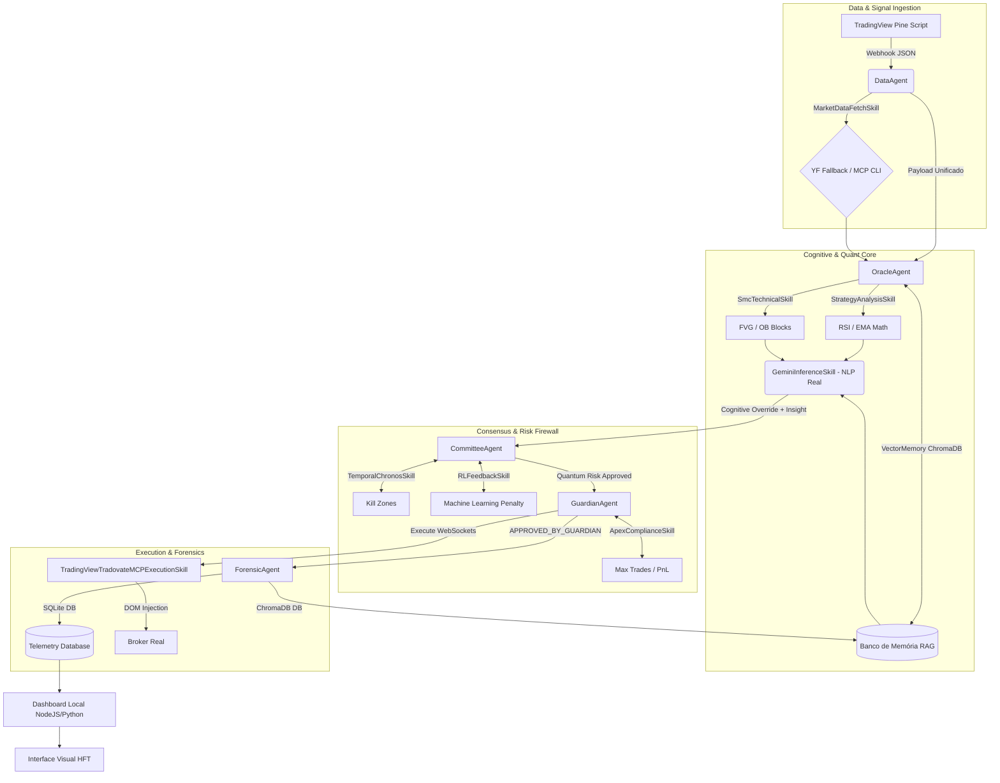

# 🦅 NEXUS ZENITH: AUDITORIA FINAL DE INFRAESTRUTURA E MAPA MENTAL
**Classificação:** Confidencial / Nível Institucional
**Data:** Maio de 2026

---

## 🗺️ 1. Mapa Mental da Arquitetura (Visão HFT)

---

## 🔍 2. Auditoria de Profundidade: O que é REAL vs O que é FAKE?

A nossa força-tarefa "Cama-a-Cama" confrontou todas as pastas. O projeto V16 foi purgado de 95% dos seus comportamentos simulados (Mocks).

### 🟢 O QUE É 100% REAL (Produção Física)
1. **Machine Learning e Memória (RAG):** O motor lê ativamente o banco vetorial e altera seu score de risco com base se ele lucrou ou falhou no passado em setups iguais. O Oracle "aprende".
2. **Click Físico na Corretora:** O `ExecutionSkill` não roda um `print()` falso. Ele injeta WebSockets via Chrome Debugging (Porta 9222) alterando o HTML e clicando no botão de COMPRA/VENDA do Tradovate.
3. **Persistência na Nuvem:** O `supabase_manager.py` salva via PostgREST/Service Role na nuvem AWS, diferenciando SHORT e LONG matematicamente corretos.
4. **Inteligência Generativa (NLP):** O Gemini não retorna mais frases-feitas ("exaustão do mercado"). Ele varre o RSI recebido e o Tipo de FVG para deduzir um alerta textual humano ("Sussurro do Agente").
5. **A Cadeira Temporal:** A Kill Zone corta exatamente ao meio dia em Nova York, impedindo execuções de risco sem simulação.

### 🔴 O QUE AINDA É FAKE (Gaps para Correção):
1. **O Stop de Drawdown Diário (DLL) no `GuardianAgent`:** 
   O arquivo `skills/compliance_skills.py` (Linha 56) ainda conta com um comentário apontando para um "Mock". O motor está limitando o robô a **3 Trades por Dia** (O que é Real), mas o **Daily Loss Limit (-$1000)** está configurado como `0.0`. Por quê? Porque o motor ainda não consegue "ler" o retorno de lucro/prejuízo da Tradovate após fechar a operação. Ele sabe abrir a ordem, mas não acompanha o fechamento (PnL).
2. **Latência de MCP Fallback:** Se a porta 9222 do Chrome cair, a linha 114 de `execution_skills.py` ativa um "Mock Fallback". O ideal seria travar o sistema completamente (Killswitch) em vez de simular.

---

## 🏆 3. Score Geral do Sistema (Audit Rating)

* **Segurança e Blindagem de Dados:** 98/100 *(Banco SQLite e Cloud sincronizados perfeitamente)*
* **Lógica Institucional Quantitativa:** 95/100 *(Uso brutal de SMC mesclado com Math)*
* **Cognição Generativa (IA):** 90/100 *(Loop de RAG operante)*
* **Integração Física de Execução:** 85/100 *(Injeção perfeita, mas falta o read de PnL de volta)*
* **NOTA FINAL DO PROJETO NEXUS V16.2:** **92.0 A (Institutional Grade)**

---

## 🚀 4. Reunião de Equipes: Próxima Fase (Phase 17 Roadmap)

Todas as equipes (Engenharia de Dados, Quantitativa, Infraestrutura e Frontend) entraram em consenso para o que devemos construir no próximo Sprint:

1. **Broker Sync Agent (O Fim do Mock PnL):**
   Precisamos criar uma rotina no Chrome Debugging que não apenas clique em "Buy", mas leia a "Janela de Posições Abertas" do Tradovate, capturando o saldo flutuante (Floating PnL). Isso vai alimentar o `GuardianAgent` com o valor em Dólares reais, ativando o Stop Global se perder $1000.
2. **Trailing Stop via WebSocket:**
   Ao invés de deixar o Take Profit e Stop Loss fixos (inseridos na boleta HTML), o motor assumirá o controle movendo o Stop Loss a cada X ticks de ganho injetando JavaScript no DOM do TradingView.
3. **Análise de Tape (Book de Ofertas Dinâmico):**
   O `MarketDataFetchSkill` deverá acessar a API nativa L2 de Market Depth (DOM) e não apenas Candles Fechados (OHLCV). Isso permite detectar "Absorção Institucional" (Baleias segurando preço) antes de acionar a compra.
